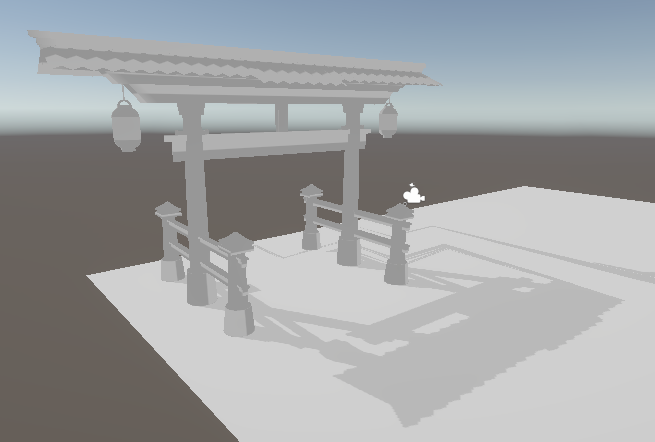
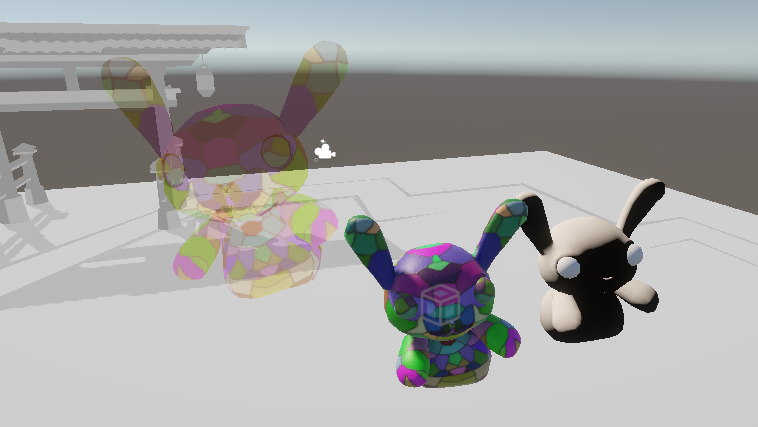
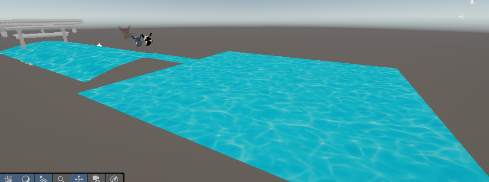

# NewCG
Week 9 Lecture Reflection

I managed to do most of the shaders today and I actually got to play around with the script part of some of them too. The shadow with texture shader had some issues but with the help of some peers, I got to make it work and look mostly correct.

 All the shaders worked today which is nice besides the glass one but I had a semi fix by just using the transparency code from last week. The whole thing can become transparent but it's not 100% accurate to glass. 
 I just used  Blend DstColor SrcColor to make it semi-transparent.
 

The water one I'm the most satisfied with.
 

 I think I did better just playing around with the shaders more as some were not working which forced me to be more practical this lecture, so that was something I was particularly stronger with this time. For weaknesses, I feel like I spent more time trying to fix things than understand the technical uniqueness of the shaders from today. For instance, aside from the shadow with texture shader, I don't think I really got to properly see how special the shadow shader was and how it visually differed from an ambient shader. The material vertex fragment shader I feel like I didn't really throughly understand either and visually, it didn't really differ much from any other tiling shader I've made in the past. 

Simple shadow and Material Vertex Fragment:
 

 Other than those 2, I feel like everything else went well.
